# Introducción teorica

Jenkins ayuda en la automatización de parte del proceso de desarrollo de software mediante integración continua y facilita ciertos aspectos de la entrega continua. Admite herramientas de control de versiones como CVS, Subversion, Git, Mercurial, Perforce y Clearcase y puede ejecutar proyectos basados en Apache Ant y Apache Maven.
# Creación de la tarea

He creado la tarea en jenkins

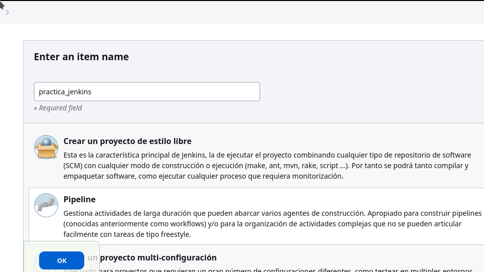

Lo he configurado para que use git con una credencial ssh, para poder utilizar esta credencial he tenido que desactivar Git Host Key Verification Configuration.

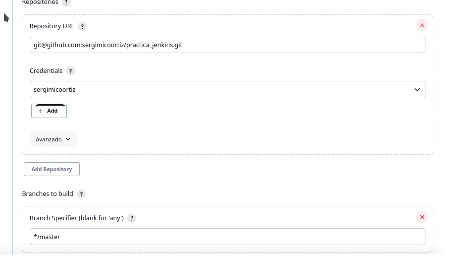
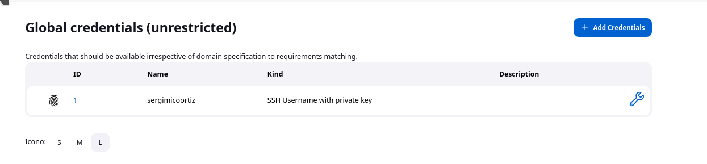
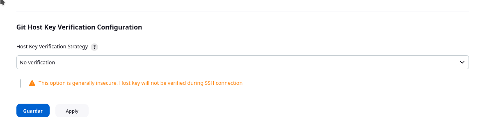

# Petición de datos

He creado el jenkinsfile el cual pide datos en una stage y los guarda en variables.

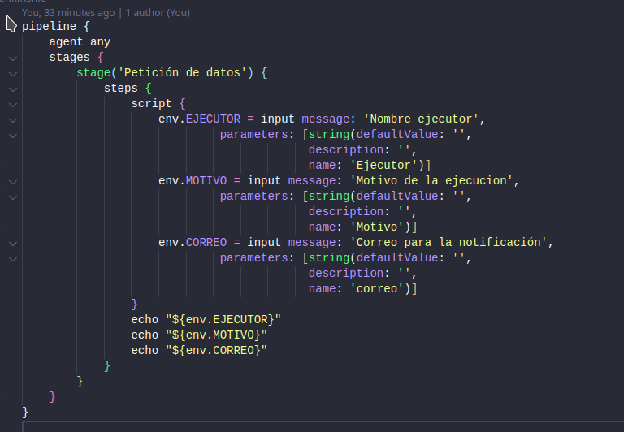
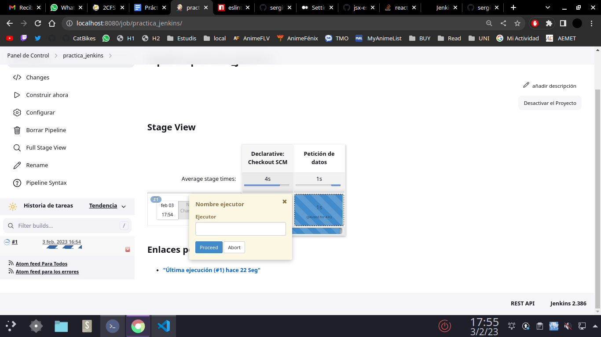
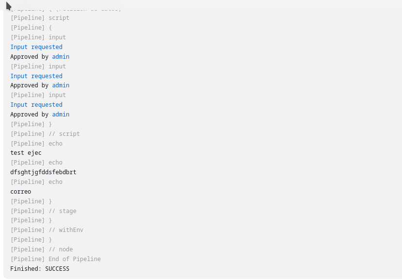

# Build Monitor View

He instalado el plugin.

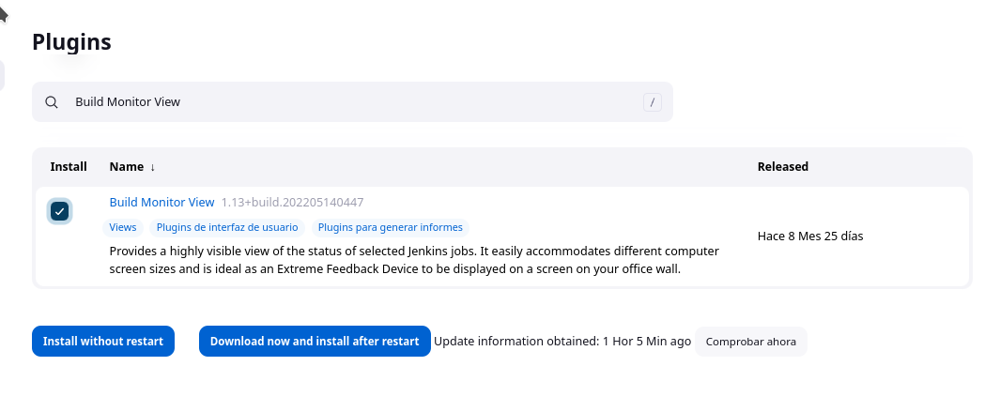

He creado la vista indicandole el job el cual debe de monitorizar.

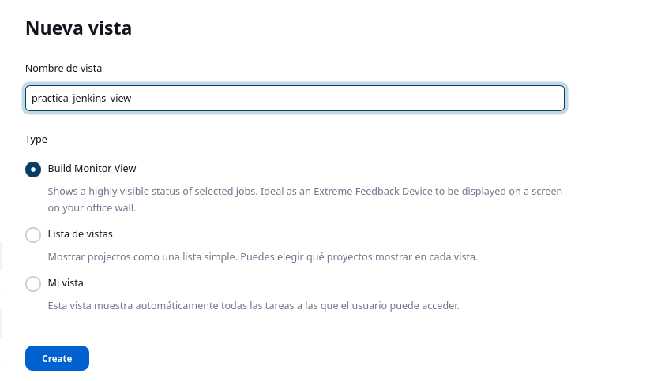
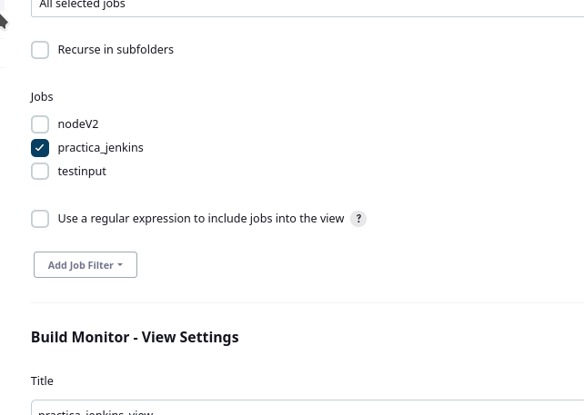
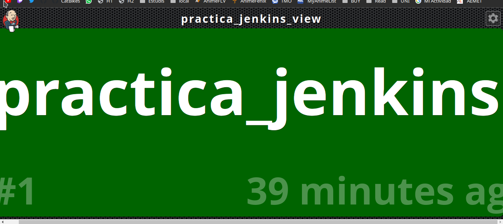

# Linter

Para poder utilizar eslint he instalado y configuradl el plugin de nodejs. De esta forma se ouede utilizar node como tool en el jenkinsfile

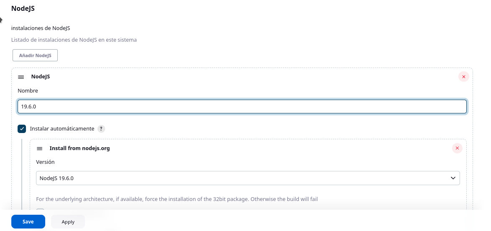

He configurado el eslint

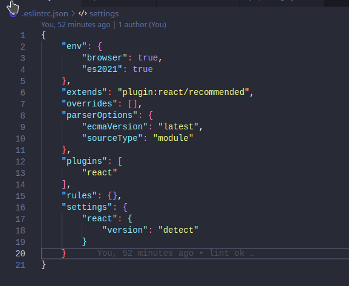

Comando que ejecuta es eslint.

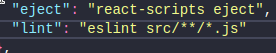

He modificado el fichero Jenkinsfile añadiendo la tool y dos stages una para instalar las dependencias de node y otro para ejecutar el eslint.

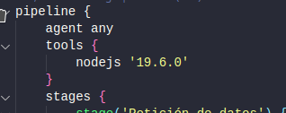
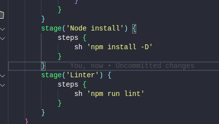

# Test

He creado los tests de jest.

Para poder utilizar jest con imports he tenido que instalar babel y realizar algunas configuraciónes.

**package.json**

**babel.config.json**

He modificado el Jenkinsfile

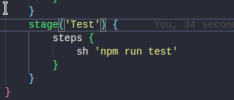

# Build

He modificado el Jenkinsfile

# Update_Readme

He modificado el Jenkinsfile

Script que realiza los cambios en el README

### RESULTADO DE LOS ÚLTIMOS TESTS:

# Push_Changes

He instalado la extención ssh agent la cual me permite utilizar las claves ssh que tengo en jenkins como credencialies en un script que realiza el commit
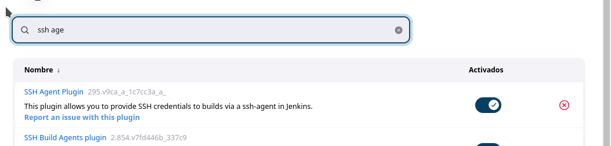

Script:
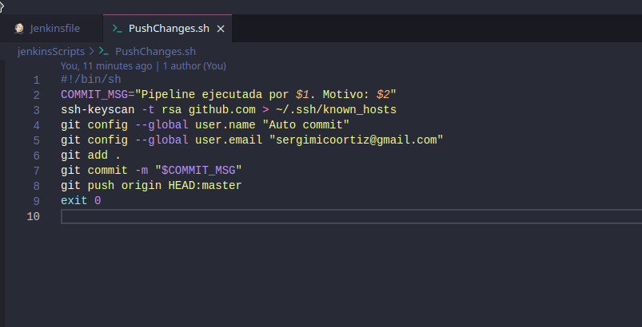

He modificado el Jenkinsfile, en el apartado de sshagent en la credencial es la ID de la credencial y no el nombre.
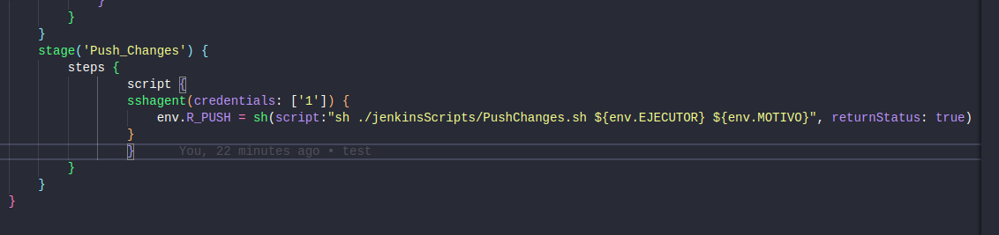
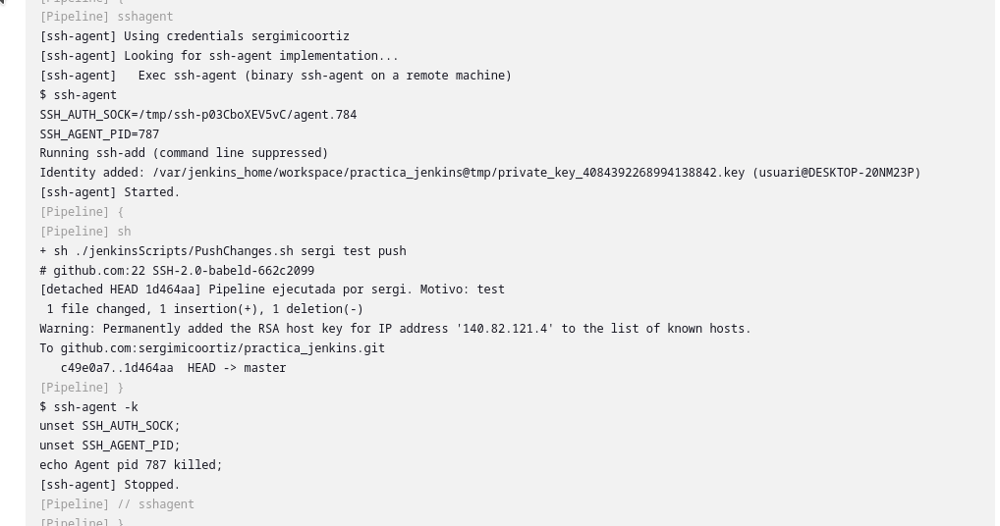
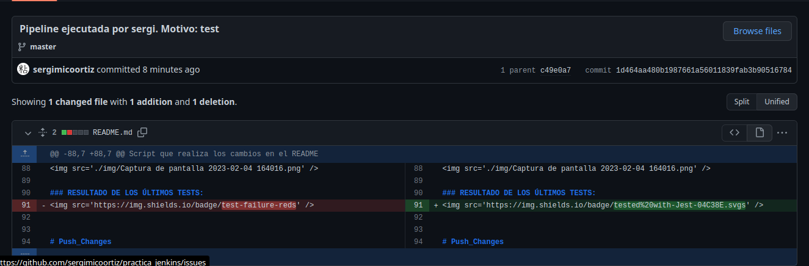

# Deploy to Vercel

### Web URL: https://practicajenkins-sergimicoortiz.vercel.app/  